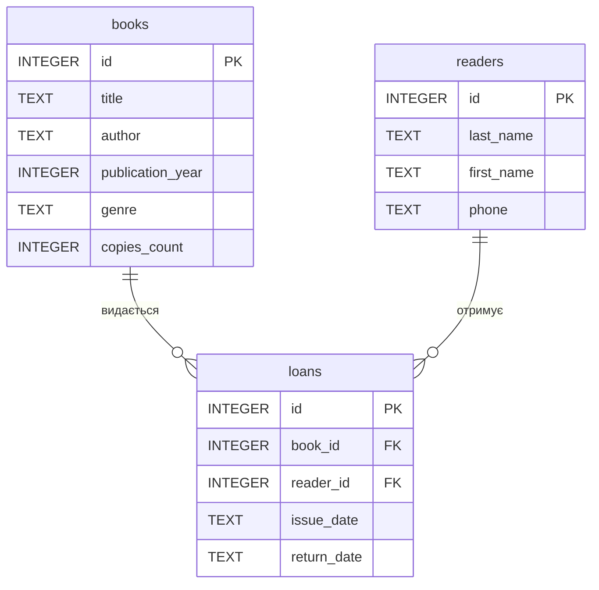

Практична робота 3(Мушка Влад)
Варіант:1
Тема: Бібліотека
Завдання 1. Побудувати ER-діаграму

books — інформація про книги;
readers — інформація про читачів;
loans — інформація про видачу книг читачам.

Таблиця loans є фактовою таблицею та містить два зовнішні ключі: book_id і reader_id.

ER-діаграма:



Пояснення

Таблиця books містить інформацію про книги: ідентифікатор, назву, автора, рік видання, жанр та кількість примірників.

Таблиця readers містить інформацію про читачів: ідентифікатор, прізвище, ім'я та номер телефону.

Таблиця loans зберігає інформацію про видачу книг. Поле book_id посилається на таблицю books, а reader_id — на таблицю readers.

Завдання 2. Визначити тип зв'язків

У схемі є два зв'язки, і обидва мають тип **1:N (один до багатьох)**.

Зв'язок books — loans

Одна книга може бути видана багато разів у різний час. Водночас кожен запис про видачу стосується тільки однієї конкретної книги.

Зв'язок readers — loans

Один читач може брати книги багато разів. Водночас кожен запис про видачу належить тільки одному читачеві.

Отже, обидва зв'язки мають тип:

1:N

Завдання 3. Визначити первинні та зовнішні ключі

Таблиця books

Первинний ключ:

id — PK

Зовнішніх ключів немає.

Таблиця readers

Первинний ключ:

id — PK

Зовнішніх ключів немає.

Таблиця loans

Первинний ключ:

id — PK

Зовнішні ключі:

book_id — FK → books.id
reader_id — FK → readers.id

Таким чином, таблиця loans пов'язує книги з читачами через зовнішні ключі.

Завдання 4. Додати нову сутність

До предметної області «Бібліотека» можна додати сутність видавці (publishers).

Таблиця publishers могла б містити:

id — ідентифікатор видавця;
name — назва видавництва;
address — адреса;
phone — номер телефону.

Між publishers і books буде зв'язок 1:N.

Один видавець може видавати багато книг, але кожна книга належить одному видавцю.

Для реалізації такого зв'язку до таблиці books можна було б додати поле publisher_id, яке було б зовнішнім ключем на publishers.id.

Завдання 5. Порівняння з прикладом хімчистки

Модель бібліотеки має подібну структуру до прикладу хімчистки.

У бібліотеці є дві основні сутності:

books;
readers.

А таблиця loans є фактовою таблицею, яка містить зв'язки з ними.

Схематично:

books → loans ← readers

В обох випадках використовуються дві основні таблиці та одна фактова таблиця з двома зовнішніми ключами.

Обидва зв'язки мають тип 1:N.

Таблиці books і readers безпосередньо між собою не зв'язані. Вони взаємодіють через таблицю loans.

Контрольні питання

1. Як відрізняється логічна модель від концептуальної, а фізична від логічної?

Концептуальна модель описує предметну область на загальному рівні. Вона показує сутності та зв'язки між ними, але не визначає конкретні таблиці, типи даних або особливості СУБД.

Логічна модель перетворює предметну область на структуру таблиць, стовпців, первинних і зовнішніх ключів. При цьому вона ще не залежить від конкретної СУБД.

Фізична модель описує реальну реалізацію бази даних у конкретній СУБД. У ній визначаються конкретні типи даних, SQL-команди створення таблиць, індекси та інші технічні особливості.

Коротко:

концептуальна → що існує;
логічна → як це організовано в таблицях;
фізична → як це реалізовано в конкретній БД.

2. Чому зв'язок M:N не можна реалізувати двома зовнішніми ключами в одній з двох основних таблиць?

Зв'язок M:N (багато до багатьох) означає, що багато записів першої таблиці можуть бути пов'язані з багатьма записами другої таблиці.

Один зовнішній ключ у таблиці може посилатися тільки на один конкретний запис іншої таблиці. Тому двох зовнішніх ключів недостатньо для зберігання всіх можливих зв'язків.

Для реалізації M:N створюють окрему проміжну таблицю. Вона містить два зовнішні ключі — по одному на кожну основну таблицю.

Наприклад, у бібліотеці таблиця loans може пов'язувати books і readers.

Тому:

M:N → окрема проміжна таблиця з двома FK.

3. Що означають ||, o{, |{ у Mermaid?

У Mermaid ці позначення використовуються для визначення кардинальності зв'язків.

|| — рівно один;
o{ — нуль або багато;
|{ — один або багато.

Наприклад:

```text
A ||--o{ B
```

читається як:

один запис A може бути пов'язаний з нулем або багатьма записами B.

У нашій схемі:

```text
books ||--o{ loans
```

означає, що **одна книга може мати нуль або багато записів про видачу**.

А:

```text
readers ||--o{ loans
```

означає, що **один читач може мати нуль або багато записів про видачу**.

Висновок

Під час практичної роботи було побудовано логічну ER-модель бази даних для предметної області «Бібліотека». Визначено три таблиці: books, readers та loans, їхні первинні й зовнішні ключі, а також два зв'язки типу 1:N. Додатково розглянуто можливість додавання сутності publishers` та опрацьовано контрольні питання щодо концептуальної, логічної і фізичної моделей баз даних.
